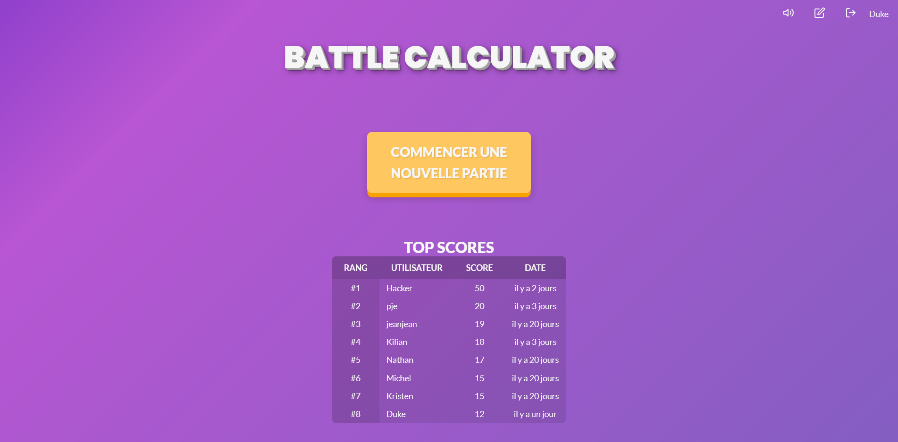
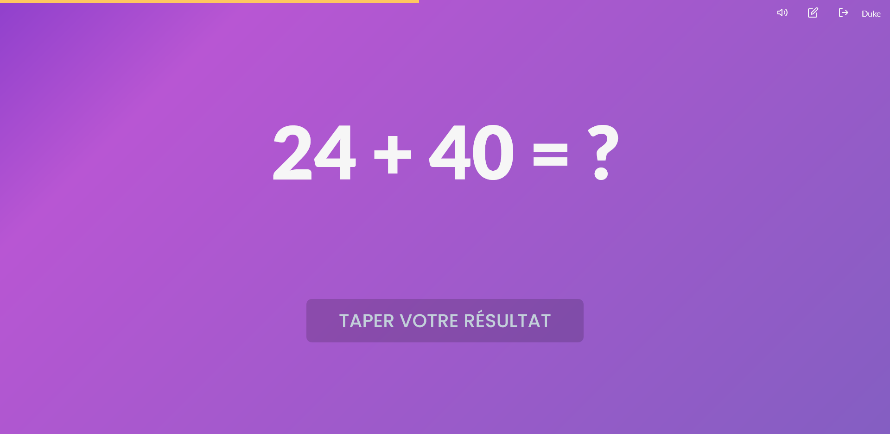

[![MIT License][license-shield]][license-url]
[![Kristen JESTIN][linkedin-kj-shield]][linkedin-kj-url]
[![Kilian MAGNIEZ][linkedin-mk-shield]][linkedin-mk-url]

<h1 align="center">
	<b>BATTLE CALCULATOR</b>
	<br />
	<small align="center">Client Web</small>
</h1>
	
<details open="open">
  <summary>Table des matières</summary>
<!-- TOC depthfrom:2 -->

-   [À propos du projet](#%C3%A0-propos-du-projet)
    -   [Dépendances](#d%C3%A9pendances)
-   [Pour commencer](#pour-commencer)
    -   [Prérequis](#pr%C3%A9requis)
    -   [Installation](#installation)
    -   [Démarrer](#d%C3%A9marrer)
-   [License](#license)
-   [Contact](#contact)

<!-- /TOC -->
</details>

## À propos du projet

Front-end de l'application.

**Sources**

[Back-End](https://github.com/school-projects-cesi/battle-calculator)


_Page d'accueil_


_Page d'une partie_

### Dépendances

-   [Node.js](https://nodejs.org/)

## Pour commencer

### Prérequis

-   [Node.js >= 14](https://nodejs.org/en/download/)
-   yarn
    ```sh
    npm install --global yarn
    ```

### Installation

1. Installer le [projet API](/school-projects-cesi/battle-calculator-api#installation)
2. Cloner le projet API dans `BattleCalculator/clients/client-app`
    ```sh
    git clone https://github.com/school-projects-cesi/battle-calculator-client-web.git
    ```
3. Installer les dépendances
    ```sh
    yarn install
    ```

### Démarrer

Lancer le serveur d'API. Le serveur de la partie front se lancera automatiquement.

## License

Distribué sous la licence MIT. Voir `LICENSE` pour plus d'informations.

<!-- CONTACT -->

## Contact

Kristen JESTIN - [contact@kristenjestin.fr](mailto:contact@kristenjestin.fr)

Kilian MAGNIEZ - [kilian.magniez@gmail.com](mailto:kilian.magniez@gmail.com)

Lien du projet : [https://github.com/school-projects-cesi/battle-calculator-client-web](https://github.com/school-projects-cesi/battle-calculator-client-web)

<!-- MARKDOWN LINKS & IMAGES -->

[license-shield]: https://img.shields.io/github/license/school-projects-cesi/battle-calculator-client-web.svg?style=for-the-badge
[license-url]: https://github.com/school-projects-cesi/battle-calculator-client-web/blob/master/LICENSE
[linkedin-kj-shield]: https://img.shields.io/badge/-LinkedIn-black.svg?style=for-the-badge&logo=linkedin&colorB=555&label=Kristen%20Jestin&color=0274b3
[linkedin-mk-shield]: https://img.shields.io/badge/-LinkedIn-black.svg?style=for-the-badge&logo=linkedin&colorB=555&label=Kilian%20Magniez&color=0274b3
[linkedin-kj-url]: https://linkedin.com/in/kristen-jestin
[linkedin-mk-url]: https://linkedin.com/in/kilian-magniez/
